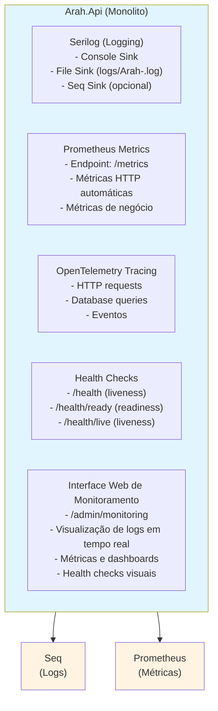
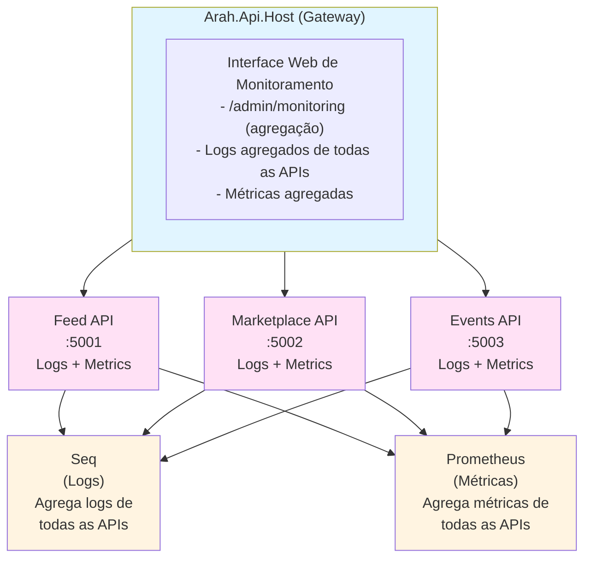
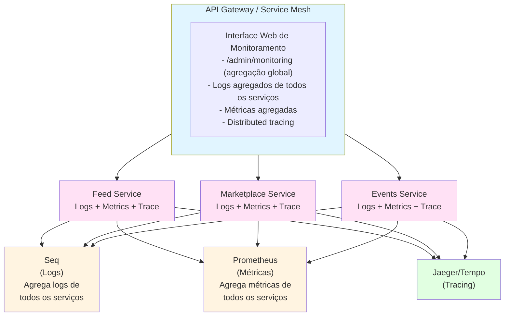
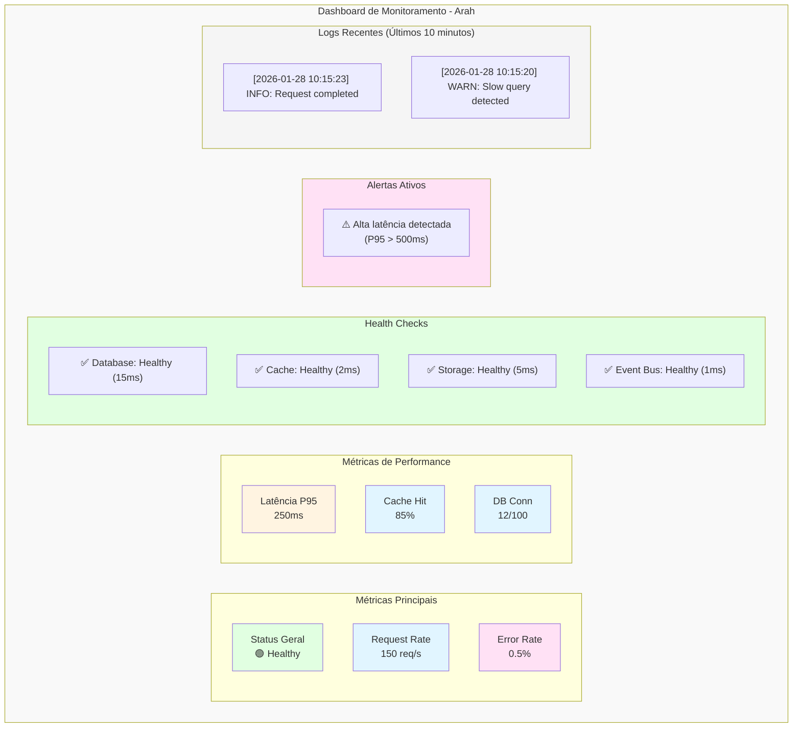

# Logs e Monitoramento - Arquitetura Monolito e Multicluster

**Data**: 2026-01-28  
**Status**: 📋 Documentação Atualizada  
**Objetivo**: Documentar estratégia de logs e monitoramento considerando arquitetura monolito e evolução para multicluster, incluindo interface web para produção

> **📊 Padrão de Diagramas**: Este documento utiliza **Mermaid** como padrão para todos os diagramas arquiteturais. Mermaid oferece melhor performance de renderização, suporte nativo em editores modernos (GitHub, GitLab, VS Code, Cursor) e facilita manutenção.

---

## 🎯 Objetivo

Definir estratégia completa de logs e monitoramento que:

1. ✅ **Funciona em arquitetura monolito** (Fase 1)
2. ✅ **Escala para APIs Modulares** (Fase 2)
3. ✅ **Prepara para Microserviços** (Fase 3)
4. ✅ **Fornece interface web** para verificação de logs e auxílio à produção
5. ✅ **Centraliza observabilidade** independente da arquitetura

---

## 📊 Arquitetura de Observabilidade

### Fase 1: Monolito (Atual)



**Características**:
- ✅ Logs locais (arquivo) + centralizados (Seq opcional)
- ✅ Métricas expostas em `/metrics`
- ✅ Tracing via OpenTelemetry
- ✅ Interface web integrada (`/admin/monitoring`)
- ✅ Health checks expostos

---

### Fase 2: APIs Modulares



**Características**:
- ✅ Logs centralizados no Seq (agregação de todas as APIs)
- ✅ Métricas agregadas no Prometheus
- ✅ Interface web no Gateway (agregação de todas as APIs)
- ✅ Correlation ID compartilhado entre APIs

---

### Fase 3: Microserviços



**Características**:
- ✅ Logs centralizados no Seq (agregação de todos os serviços)
- ✅ Métricas agregadas no Prometheus
- ✅ Tracing distribuído (Jaeger/Tempo)
- ✅ Interface web no Gateway (agregação global)
- ✅ Service mesh para observabilidade

---

## 🖥️ Interface Web de Monitoramento

### Visão Geral

A aplicação terá uma **interface web integrada** para monitoramento e auxílio à produção, acessível em `/admin/monitoring`.

**Objetivos**:
- ✅ Visualização de logs em tempo real
- ✅ Métricas e dashboards
- ✅ Health checks visuais
- ✅ Troubleshooting assistido
- ✅ Alertas e notificações
- ✅ Acesso rápido a informações críticas

### Funcionalidades

#### 1. Dashboard Principal

**URL**: `/admin/monitoring`

**Componentes**:
- **Status Geral**: Saúde do sistema (verde/amarelo/vermelho)
- **Métricas Principais**: Request rate, error rate, latência
- **Health Checks**: Status de dependências (banco, cache, storage)
- **Alertas Ativos**: Lista de alertas e notificações
- **Atividade Recente**: Últimos logs importantes

#### 2. Visualizador de Logs

**URL**: `/admin/monitoring/logs`

**Funcionalidades**:
- ✅ **Filtros**:
  - Por nível (Error, Warning, Information, Debug)
  - Por componente/módulo
  - Por Correlation ID
  - Por período (última hora, últimas 24h, etc.)
  - Por texto (busca)
- ✅ **Visualização**:
  - Lista de logs em tempo real (WebSocket/SSE)
  - Formatação colorida por nível
  - Detalhes expandíveis (stack trace, contexto)
  - Exportação (JSON, CSV)
- ✅ **Agregação**:
  - Contagem de erros por tipo
  - Top 10 erros mais frequentes
  - Timeline de eventos

#### 3. Métricas e Dashboards

**URL**: `/admin/monitoring/metrics`

**Funcionalidades**:
- ✅ **Gráficos em Tempo Real**:
  - Request rate (req/s)
  - Error rate (%)
  - Latência (P50, P95, P99)
  - Cache hit rate
  - Database connections
- ✅ **Métricas de Negócio**:
  - Posts criados (última hora/dia)
  - Eventos criados
  - Membros criados
  - Transações processadas
- ✅ **Métricas de Sistema**:
  - CPU usage
  - Memory usage
  - Disk I/O
  - Network I/O

#### 4. Health Checks Visuais

**URL**: `/admin/monitoring/health`

**Funcionalidades**:
- ✅ **Status de Dependências**:
  - Database (PostgreSQL)
  - Cache (Redis/IMemoryCache)
  - Storage (S3/Local)
  - Event Bus
  - External APIs (se aplicável)
- ✅ **Detalhes**:
  - Tempo de resposta
  - Última verificação
  - Histórico de falhas
  - Ações recomendadas

#### 5. Troubleshooting Assistido

**URL**: `/admin/monitoring/troubleshooting`

**Funcionalidades**:
- ✅ **Diagnóstico Automático**:
  - Verificação de problemas comuns
  - Sugestões de solução
  - Links para documentação
- ✅ **Comandos Úteis**:
  - Verificar health
  - Verificar métricas
  - Verificar logs
  - Verificar cache
  - Verificar banco de dados
- ✅ **Guia de Resolução**:
  - Problemas comuns e soluções
  - Procedimentos de emergência
  - Contatos de escalação

---

## 📋 Implementação da Interface Web

### Estrutura de Arquivos

```
backend/Arah.Api/
├── Controllers/
│   └── Admin/
│       ├── MonitoringController.cs          # Endpoints de monitoramento
│       ├── LogsController.cs                # API de logs
│       └── MetricsController.cs             # API de métricas
├── Services/
│   └── Monitoring/
│       ├── ILogViewerService.cs             # Serviço de visualização de logs
│       ├── LogViewerService.cs              # Implementação
│       ├── IMetricsAggregatorService.cs     # Agregação de métricas
│       └── MetricsAggregatorService.cs      # Implementação
├── wwwroot/
│   └── admin/
│       └── monitoring/
│           ├── index.html                   # Dashboard principal
│           ├── logs.html                   # Visualizador de logs
│           ├── metrics.html                # Métricas e dashboards
│           ├── health.html                 # Health checks
│           ├── troubleshooting.html         # Troubleshooting
│           └── assets/
│               ├── monitoring.js            # JavaScript
│               └── monitoring.css           # Estilos
└── Hubs/
    └── LogsHub.cs                           # SignalR para logs em tempo real
```

### Endpoints da API

#### 1. Logs API

```csharp
[ApiController]
[Route("api/v1/admin/monitoring/logs")]
[Authorize(Policy = "SystemAdmin")]
public sealed class LogsController : ControllerBase
{
    /// <summary>
    /// Lista logs com filtros.
    /// </summary>
    [HttpGet]
    public async Task<ActionResult<PagedLogsResponse>> GetLogs(
        [FromQuery] LogLevel? level,
        [FromQuery] string? component,
        [FromQuery] string? correlationId,
        [FromQuery] DateTime? from,
        [FromQuery] DateTime? to,
        [FromQuery] string? search,
        [FromQuery] int pageNumber = 1,
        [FromQuery] int pageSize = 100)
    {
        // Buscar logs do arquivo ou Seq
        // Aplicar filtros
        // Retornar página de logs
    }
    
    /// <summary>
    /// Obtém estatísticas de logs.
    /// </summary>
    [HttpGet("stats")]
    public async Task<ActionResult<LogStatsResponse>> GetLogStats(
        [FromQuery] DateTime? from,
        [FromQuery] DateTime? to)
    {
        // Contar logs por nível
        // Top 10 erros mais frequentes
        // Timeline de eventos
    }
    
    /// <summary>
    /// Exporta logs.
    /// </summary>
    [HttpGet("export")]
    public async Task<IActionResult> ExportLogs(
        [FromQuery] LogLevel? level,
        [FromQuery] DateTime? from,
        [FromQuery] DateTime? to,
        [FromQuery] string format = "json")
    {
        // Exportar logs em formato JSON ou CSV
    }
}
```

#### 2. Métricas API

```csharp
[ApiController]
[Route("api/v1/admin/monitoring/metrics")]
[Authorize(Policy = "SystemAdmin")]
public sealed class MetricsController : ControllerBase
{
    /// <summary>
    /// Obtém métricas agregadas.
    /// </summary>
    [HttpGet]
    public async Task<ActionResult<MetricsResponse>> GetMetrics(
        [FromQuery] string? metric,
        [FromQuery] DateTime? from,
        [FromQuery] DateTime? to)
    {
        // Buscar métricas do Prometheus ou cache
        // Agregar se necessário
        // Retornar métricas
    }
    
    /// <summary>
    /// Obtém métricas em tempo real (últimos 5 minutos).
    /// </summary>
    [HttpGet("realtime")]
    public async Task<ActionResult<RealtimeMetricsResponse>> GetRealtimeMetrics()
    {
        // Métricas dos últimos 5 minutos
        // Atualização a cada 10 segundos
    }
}
```

#### 3. Health Checks API

```csharp
[ApiController]
[Route("api/v1/admin/monitoring/health")]
[Authorize(Policy = "SystemAdmin")]
public sealed class HealthController : ControllerBase
{
    /// <summary>
    /// Obtém status detalhado de health checks.
    /// </summary>
    [HttpGet("detailed")]
    public async Task<ActionResult<DetailedHealthResponse>> GetDetailedHealth()
    {
        // Executar todos os health checks
        // Retornar status detalhado
        // Incluir tempo de resposta
        // Incluir histórico de falhas
    }
}
```

### SignalR para Logs em Tempo Real

```csharp
// Arah.Api/Hubs/LogsHub.cs
public sealed class LogsHub : Hub
{
    private readonly ILogViewerService _logViewerService;
    
    public async Task SubscribeToLogs(string? level, string? component)
    {
        await Groups.AddToGroupAsync(Context.ConnectionId, "logs");
        // Enviar logs recentes
        var recentLogs = await _logViewerService.GetRecentLogsAsync(level, component);
        await Clients.Caller.SendAsync("LogsReceived", recentLogs);
    }
    
    public async Task UnsubscribeFromLogs()
    {
        await Groups.RemoveFromGroupAsync(Context.ConnectionId, "logs");
    }
}
```

---

## 🔧 Configuração por Arquitetura

### Monolito (Fase 1)

#### Logs

**Configuração** (`appsettings.json`):
```json
{
  "Logging": {
    "LogLevel": {
      "Default": "Information",
      "Arah": "Information"
    },
    "Seq": {
      "ServerUrl": "http://localhost:5341",
      "ApiKey": "",
      "Enabled": false
    }
  },
  "Serilog": {
    "WriteTo": [
      {
        "Name": "Console"
      },
      {
        "Name": "File",
        "Args": {
          "path": "logs/Arah-.log",
          "rollingInterval": "Day",
          "retainedFileCountLimit": 30
        }
      }
    ]
  },
  "Monitoring": {
    "WebInterface": {
      "Enabled": true,
      "RequireAuth": true,
      "MaxLogLines": 10000,
      "RealtimeUpdateInterval": 10000
    }
  }
}
```

**Características**:
- ✅ Logs em arquivo local (`logs/Arah-.log`)
- ✅ Seq opcional (para centralização)
- ✅ Interface web integrada (`/admin/monitoring`)
- ✅ Logs em tempo real via SignalR

#### Métricas

**Configuração**:
```json
{
  "Metrics": {
    "Prometheus": {
      "Enabled": true,
      "Port": 9090
    }
  }
}
```

**Características**:
- ✅ Endpoint `/metrics` exposto
- ✅ Métricas HTTP automáticas
- ✅ Métricas de negócio
- ✅ Visualização na interface web

---

### APIs Modulares (Fase 2)

#### Logs Centralizados

**Configuração**:
```json
{
  "Logging": {
    "Seq": {
      "ServerUrl": "http://seq:5341",
      "ApiKey": "${SEQ_API_KEY}",
      "Enabled": true
    }
  },
  "Monitoring": {
    "WebInterface": {
      "Enabled": true,
      "AggregateFromApis": true,
      "ApiEndpoints": [
        "http://feed-api:5001",
        "http://marketplace-api:5002",
        "http://events-api:5003"
      ]
    }
  }
}
```

**Características**:
- ✅ Logs centralizados no Seq
- ✅ Interface web no Gateway agrega logs de todas as APIs
- ✅ Correlation ID compartilhado
- ✅ Filtros por API/instância

#### Métricas Agregadas

**Configuração**:
```json
{
  "Metrics": {
    "Prometheus": {
      "Enabled": true,
      "Port": 9090,
      "ScrapeConfigs": [
        {
          "JobName": "feed-api",
          "Targets": ["http://feed-api:5001/metrics"]
        },
        {
          "JobName": "marketplace-api",
          "Targets": ["http://marketplace-api:5002/metrics"]
        },
        {
          "JobName": "events-api",
          "Targets": ["http://events-api:5003/metrics"]
        }
      ]
    }
  }
}
```

**Características**:
- ✅ Prometheus coleta métricas de todas as APIs
- ✅ Interface web agrega métricas
- ✅ Dashboards por API ou agregados

---

### Microserviços (Fase 3)

#### Observabilidade Distribuída

**Configuração**:
```json
{
  "Logging": {
    "Seq": {
      "ServerUrl": "http://seq:5341",
      "ApiKey": "${SEQ_API_KEY}",
      "Enabled": true
    }
  },
  "OpenTelemetry": {
    "Otlp": {
      "Endpoint": "http://tempo:4317"
    },
    "Jaeger": {
      "Endpoint": "http://jaeger:14250"
    }
  },
  "Monitoring": {
    "WebInterface": {
      "Enabled": true,
      "AggregateFromServices": true,
      "ServiceDiscovery": "consul",
      "ServiceMesh": "istio"
    }
  }
}
```

**Características**:
- ✅ Logs centralizados no Seq (todos os serviços)
- ✅ Tracing distribuído (Jaeger/Tempo)
- ✅ Métricas agregadas (Prometheus)
- ✅ Interface web no Gateway (agregação global)
- ✅ Service mesh para observabilidade

---

## 🖥️ Interface Web - Detalhamento

### Página Principal: Dashboard

**URL**: `/admin/monitoring`

**Layout**:



### Página de Logs

**URL**: `/admin/monitoring/logs`

**Funcionalidades**:
- ✅ **Filtros Laterais**:
  - Nível: All, Error, Warning, Information, Debug
  - Componente: All, Feed, Events, Marketplace, etc.
  - Período: Última hora, últimas 24h, últimos 7 dias, custom
  - Busca por texto
  - Correlation ID
- ✅ **Visualização**:
  - Lista de logs com scroll infinito
  - Cores por nível (vermelho=Error, amarelo=Warning, etc.)
  - Detalhes expandíveis (stack trace, contexto)
  - Timestamp formatado
  - Auto-refresh (opcional)
- ✅ **Estatísticas**:
  - Total de logs no período
  - Distribuição por nível (gráfico de pizza)
  - Top 10 erros mais frequentes
  - Timeline de eventos (gráfico de linha)

### Página de Métricas

**URL**: `/admin/monitoring/metrics`

**Funcionalidades**:
- ✅ **Gráficos em Tempo Real**:
  - Request rate (gráfico de linha, atualização a cada 10s)
  - Error rate (gráfico de linha)
  - Latência (P50, P95, P99 em gráfico de linha)
  - Cache hit rate (gráfico de linha)
  - Database connections (gráfico de linha)
- ✅ **Métricas de Negócio**:
  - Posts criados (última hora/dia)
  - Eventos criados
  - Membros criados
  - Transações processadas
- ✅ **Métricas de Sistema**:
  - CPU usage (gráfico de área)
  - Memory usage (gráfico de área)
  - Disk I/O (gráfico de linha)
  - Network I/O (gráfico de linha)

### Página de Health Checks

**URL**: `/admin/monitoring/health`

**Funcionalidades**:
- ✅ **Status de Dependências**:
  - Database (PostgreSQL)
    - Status: Healthy/Unhealthy/Degraded
    - Tempo de resposta: 15ms
    - Última verificação: 2026-01-28 10:15:23
    - Histórico: Últimas 10 verificações
  - Cache (Redis/IMemoryCache)
    - Status: Healthy
    - Tempo de resposta: 2ms
    - Hit rate: 85%
  - Storage (S3/Local)
    - Status: Healthy
    - Tempo de resposta: 5ms
  - Event Bus
    - Status: Healthy
    - Tempo de resposta: 1ms
    - Eventos pendentes: 0
- ✅ **Ações Recomendadas**:
  - Se Database Unhealthy: Verificar conexão, verificar logs
  - Se Cache Unhealthy: Verificar Redis, verificar fallback
  - Links para troubleshooting

### Página de Troubleshooting

**URL**: `/admin/monitoring/troubleshooting`

**Funcionalidades**:
- ✅ **Diagnóstico Automático**:
  - Verificação de problemas comuns
  - Sugestões de solução
  - Links para documentação
- ✅ **Comandos Úteis**:
  - Verificar health: `curl /health/ready`
  - Verificar métricas: `curl /metrics`
  - Verificar logs: Link para página de logs
  - Verificar cache: Link para métricas de cache
  - Verificar banco: Link para health checks
- ✅ **Guia de Resolução**:
  - Problemas comuns e soluções
  - Procedimentos de emergência
  - Contatos de escalação

---

## 🔐 Segurança da Interface Web

### Autenticação e Autorização

- ✅ **Autenticação obrigatória**: Apenas usuários autenticados
- ✅ **Autorização**: Apenas `SystemAdmin` ou `Curator` (configurável)
- ✅ **Rate limiting**: Limitar requisições à API de logs
- ✅ **Sanitização**: Sanitizar logs antes de exibir (prevenir XSS)
- ✅ **Auditoria**: Logar acesso à interface de monitoramento

### Configuração

```json
{
  "Monitoring": {
    "WebInterface": {
      "Enabled": true,
      "RequireAuth": true,
      "RequiredRole": "SystemAdmin",
      "RateLimit": {
        "MaxRequests": 100,
        "WindowMinutes": 1
      },
      "SanitizeLogs": true,
      "MaxLogLines": 10000,
      "RealtimeUpdateInterval": 10000
    }
  }
}
```

---

## 📊 Agregação em Multicluster

### Quando Múltiplas Instâncias (Monolito Escalado)

**Desafio**: Logs e métricas de múltiplas instâncias do mesmo serviço.

**Solução**:
- ✅ **Logs**: Centralizar no Seq (todas as instâncias enviam para o mesmo Seq)
- ✅ **Métricas**: Prometheus coleta de todas as instâncias (service discovery)
- ✅ **Interface Web**: Agrega logs e métricas de todas as instâncias
- ✅ **Identificação**: Adicionar `InstanceId` aos logs (hostname, pod name, etc.)

**Configuração**:
```json
{
  "Serilog": {
    "Properties": {
      "InstanceId": "${HOSTNAME}",
      "Application": "Arah.Api"
    }
  }
}
```

### Quando APIs Modulares

**Desafio**: Logs e métricas de múltiplas APIs diferentes.

**Solução**:
- ✅ **Logs**: Seq agrega logs de todas as APIs (identificar por `Application` property)
- ✅ **Métricas**: Prometheus coleta de todas as APIs (job labels)
- ✅ **Interface Web**: Gateway agrega de todas as APIs via HTTP
- ✅ **Filtros**: Permitir filtrar por API/instância

**Configuração**:
```json
{
  "Monitoring": {
    "WebInterface": {
      "AggregateFromApis": true,
      "ApiEndpoints": [
        {
          "Name": "Feed API",
          "BaseUrl": "http://feed-api:5001",
          "HealthEndpoint": "/health",
          "MetricsEndpoint": "/metrics"
        },
        {
          "Name": "Marketplace API",
          "BaseUrl": "http://marketplace-api:5002",
          "HealthEndpoint": "/health",
          "MetricsEndpoint": "/metrics"
        }
      ]
    }
  }
}
```

### Quando Microserviços

**Desafio**: Logs, métricas e tracing de múltiplos serviços independentes.

**Solução**:
- ✅ **Logs**: Seq agrega logs de todos os serviços (identificar por `Service` property)
- ✅ **Métricas**: Prometheus coleta de todos os serviços (service discovery)
- ✅ **Tracing**: Jaeger/Tempo agrega traces de todos os serviços
- ✅ **Interface Web**: Gateway agrega de todos os serviços
- ✅ **Service Mesh**: Istio/Linkerd fornece observabilidade adicional

---

## 📋 Implementação Passo a Passo

### Fase 1: Interface Web Básica (1 semana)

#### 1.1 Estrutura Base (2 dias)
- [ ] Criar estrutura de arquivos (`wwwroot/admin/monitoring/`)
- [ ] Criar páginas HTML básicas
- [ ] Criar CSS e JavaScript básicos
- [ ] Configurar roteamento

#### 1.2 API de Logs (2 dias)
- [ ] Criar `LogsController`
- [ ] Implementar `ILogViewerService` (ler arquivo de logs)
- [ ] Implementar filtros (nível, componente, período)
- [ ] Implementar paginação
- [ ] Testes

#### 1.3 API de Métricas (1 dia)
- [ ] Criar `MetricsController`
- [ ] Implementar `IMetricsAggregatorService`
- [ ] Agregar métricas do Prometheus
- [ ] Testes

#### 1.4 Dashboard Principal (1 dia)
- [ ] Criar dashboard HTML
- [ ] Integrar com APIs
- [ ] Visualização básica de métricas
- [ ] Health checks visuais

### Fase 2: Logs em Tempo Real (1 semana)

#### 2.1 SignalR Hub (2 dias)
- [ ] Criar `LogsHub`
- [ ] Implementar subscribe/unsubscribe
- [ ] Broadcast de logs em tempo real
- [ ] Testes

#### 2.2 Visualizador de Logs (2 dias)
- [ ] Criar página de logs HTML
- [ ] Implementar filtros
- [ ] Implementar scroll infinito
- [ ] Implementar auto-refresh
- [ ] Formatação de logs

#### 2.3 Estatísticas de Logs (1 dia)
- [ ] Implementar contagem por nível
- [ ] Top 10 erros mais frequentes
- [ ] Timeline de eventos
- [ ] Visualização (gráficos)

### Fase 3: Métricas e Dashboards (1 semana)

#### 3.1 Gráficos de Métricas (3 dias)
- [ ] Integrar biblioteca de gráficos (Chart.js ou similar)
- [ ] Gráficos de request rate, error rate, latência
- [ ] Gráficos de métricas de negócio
- [ ] Atualização em tempo real

#### 3.2 Dashboards Customizáveis (2 dias)
- [ ] Permitir adicionar/remover gráficos
- [ ] Salvar configuração de dashboard
- [ ] Múltiplos dashboards (Performance, Negócio, Sistema)

### Fase 4: Agregação Multicluster (1 semana)

#### 4.1 Agregação de Logs (2 dias)
- [ ] Implementar agregação de múltiplas instâncias
- [ ] Implementar agregação de múltiplas APIs
- [ ] Filtros por instância/API
- [ ] Testes

#### 4.2 Agregação de Métricas (2 dias)
- [ ] Implementar agregação de métricas
- [ ] Suporte a service discovery
- [ ] Filtros por serviço/instância
- [ ] Testes

#### 4.3 Interface Multicluster (1 dia)
- [ ] Seleção de instância/API/serviço
- [ ] Visualização agregada ou por instância
- [ ] Comparação entre instâncias

---

## ⏱️ Estimativa de Esforço

| Fase | Descrição | Duração | Esforço (horas) |
|------|-----------|---------|-----------------|
| **Fase 1** | Interface Web Básica | 1 semana | 40h |
| **Fase 2** | Logs em Tempo Real | 1 semana | 40h |
| **Fase 3** | Métricas e Dashboards | 1 semana | 40h |
| **Fase 4** | Agregação Multicluster | 1 semana | 40h |
| **TOTAL** | | **4 semanas** | **160h** |

---

## 🔐 Segurança e Privacidade

### Dados Sensíveis em Logs

- ✅ **Sanitização**: Remover senhas, tokens, CPFs dos logs antes de exibir
- ✅ **Mascaramento**: Mascarar dados sensíveis (ex: `CPF: ***.***.***-**`)
- ✅ **Filtros**: Não exibir logs com dados sensíveis por padrão
- ✅ **Auditoria**: Logar quem acessou logs com dados sensíveis

### Acesso à Interface

- ✅ **Autenticação obrigatória**: Apenas usuários autenticados
- ✅ **Autorização**: Apenas roles específicas (SystemAdmin, Curator)
- ✅ **Rate limiting**: Limitar requisições
- ✅ **HTTPS obrigatório**: Sempre usar HTTPS em produção
- ✅ **CSP**: Content Security Policy para prevenir XSS

---

## 📚 Referências

- **Fase 4**: [`FASE4.md`](./backlog-api/FASE4.md) - Observabilidade e Monitoramento
- **Métricas**: [`METRICS.md`](./METRICS.md) - Lista completa de métricas
- **Monitoramento**: [`MONITORING.md`](./MONITORING.md) - Dashboards e alertas
- **Troubleshooting**: [`TROUBLESHOOTING.md`](./TROUBLESHOOTING.md) - Troubleshooting comum
- **Runbook**: [`RUNBOOK.md`](./RUNBOOK.md) - Runbook de operações

---

**Última Atualização**: 2026-01-28  
**Status**: 📋 Documentação Completa - Pronta para Implementação
